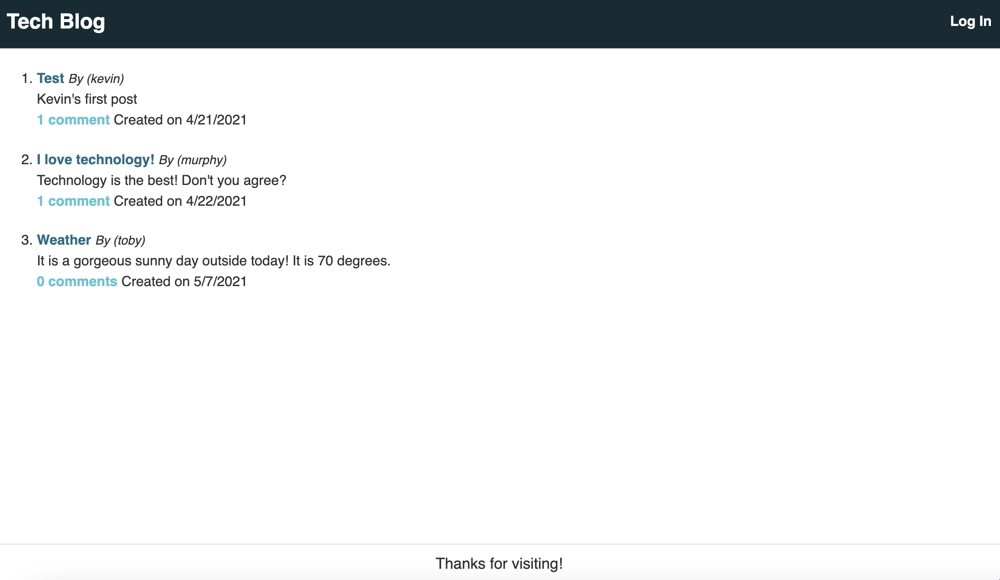

# Tech Blog

## User Story

```
AS A developer who writes about tech
I WANT a CMS-style blog site
SO THAT I can publish articles, blog posts, and my thoughts and opinions
```

## Description

When the user opens the application they are presented with a homepage that has existing blog posts displayed. If the user clicks the homepage option, they are taken to the homepage. If they click the Log in link, they are prompted to log in. If they click the Sign Up link, they are prompted to sign up. When they choose sign up, they are prompted to create a username and password. If they click the log in they are prompted to enter that username and password.

Once signed into the site, they see navigation links for the homepage, dashboard, and the ability to log out. If they click on an existing blog post, they see the post title, contents, and creator's username. They can enter a comment and submit the comment. The comment is then displayed with the post.

If they click dashboard option then they are presented with any blog posts that the user has created. They can add a new blog post, where they are prompted to put a title and the contents for their blog post.

If they click on any of their blog posts, they are also able to update or delete the blog post.

If the user is idle on the page for more than a set time, they are logged out.

## Table of Contents

- [Deployed Site](#deployedsite)

- [Screenshot](#screenshot)

- [Contribution](#contribution)

- [Questions](#questions)

## Deployed Site

Please visit the deployed site [here](https://sheltered-wildwood-97487.herokuapp.com/).

## Screenshot



## Contribution

All contributions are welcome. Please visit the [issues](https://github.com/pmac16/mvc-tech-blog/issues) tab to contribute.

## Questions

If you have additional questions, please visit me on [Github](https://github.com/pmac16)
